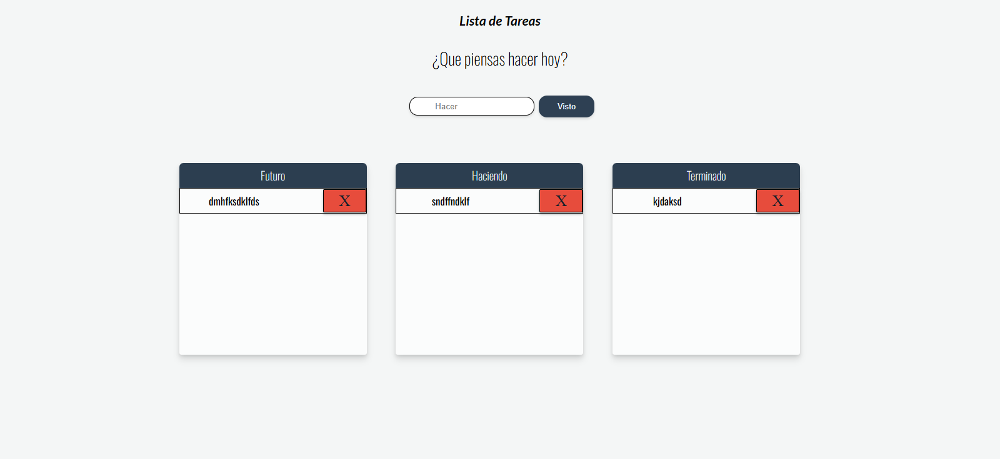

# List-to-do-

Es una lista de tarea la cuales te permite ponerlos en 3 estados distintos: Futuro, Haciendo, Terminando. 
Esta se puede mover entre si para cuando termina una tarea, suando las tareas son eliminadas apareceran en la parte superior para si quieres volver a colocarlas. 